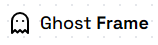
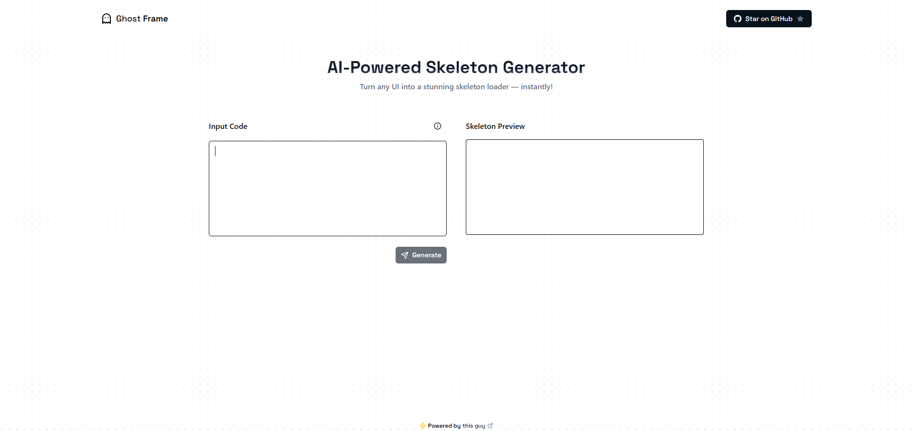
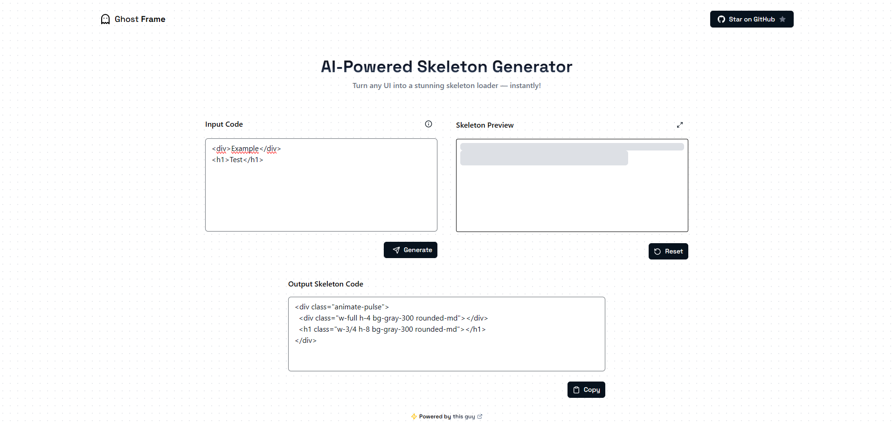

<div align="center">
  <a href="https://ghost-frame.vercel.app/">
    
  </a>
  
  <br />
  
  <p align="center">
    Turn any UI into a stunning skeleton loader — instantly!
    <br />
    <br />
    <a href=https://ghost-frame.vercel.app/">View Demo</a>
    &middot;
    <a href="https://github.com/devpedromgoncalves/ghost-frame/issues">Report Bug</a>
  </p>

   
</div>

---

## 📝 **Description**

GhostFrame is a utility for generating **skeleton loading screens** in applications using **TailwindCSS**. <br />
It dynamically transforms (using AI) user-provided HTML into skeleton placeholders, ensuring a smooth and consistent loading experience.

---

## 💡 **Features**

- **AI Generated:**
  - Created using AI (**Dolphin3.0 Mistral** model). 

- **Dynamic Skeleton Generation:**
  - Converts any HTML structure into a skeleton loading screen.
  - Preserves the original structure and hierarchy of the component.

- **TailwindCSS Integration:**
  - Uses TailwindCSS utility classes for styling.
  - Ensures consistency with `bg-gray-300` for placeholders and `animate-pulse` for animations.

- **Customizable Dimensions:**
  - Applies default dimensions for common elements (e.g., `div`, `h1`, `button`, `img`).
  - Supports responsive classes (e.g., `sm:`, `md:`, `lg:`).

---

## 🛠️ **How It Works**

The **Skeleton Generator** takes user-provided HTML and transforms it into a skeleton loading screen by:
1. Removing all text content and child elements.
2. Adding TailwindCSS classes (`bg-gray-300`, `animate-pulse`, `rounded-md`, etc.) to create placeholders.
3. Preserving the original structure, hierarchy, and responsive classes.

---

### </> **Example**

#### Input (User Code):
```html
<nav class="flex items-center justify-between p-4">
  <div class="text-lg font-bold">Logo</div>
  <ul class="flex space-x-4">
    <li class="text-gray-700">Home</li>
    <li class="text-gray-700">About</li>
    <li class="text-gray-700">Contact</li>
  </ul>
  <button class="bg-blue-500 text-white px-4 py-2 rounded-md">Sign Up</button>
</nav>
```

#### Output:
```html
<nav class="flex items-center justify-between p-4 animate-pulse">
  <div class="w-3/4 h-8 bg-gray-300 rounded-md">
  <ul class="flex space-x-4">
    <li class="w-full h-4 bg-gray-300 rounded-md">
    <li class="w-full h-4 bg-gray-300 rounded-md">
    <li class="w-full h-4 bg-gray-300 rounded-md">
  </ul>
  <button class="w-24 h-10 bg-gray-300 rounded-md">
</nav>
```

---

## 📸 **Screenshots**


<br/>


## Development server

To start a local development server, run:

```bash
ng serve
```

Once the server is running, open your browser and navigate to `http://localhost:4200/`. The application will automatically reload whenever you modify any of the source files.

## Code scaffolding

Angular CLI includes powerful code scaffolding tools. To generate a new component, run:

```bash
ng generate component component-name
```

For a complete list of available schematics (such as `components`, `directives`, or `pipes`), run:

```bash
ng generate --help
```

## Building

To build the project run:

```bash
ng build
```

This will compile your project and store the build artifacts in the `dist/` directory. By default, the production build optimizes your application for performance and speed.

## Additional Resources

For more information on using the Angular CLI, including detailed command references, visit the [Angular CLI Overview and Command Reference](https://angular.dev/tools/cli) page.

